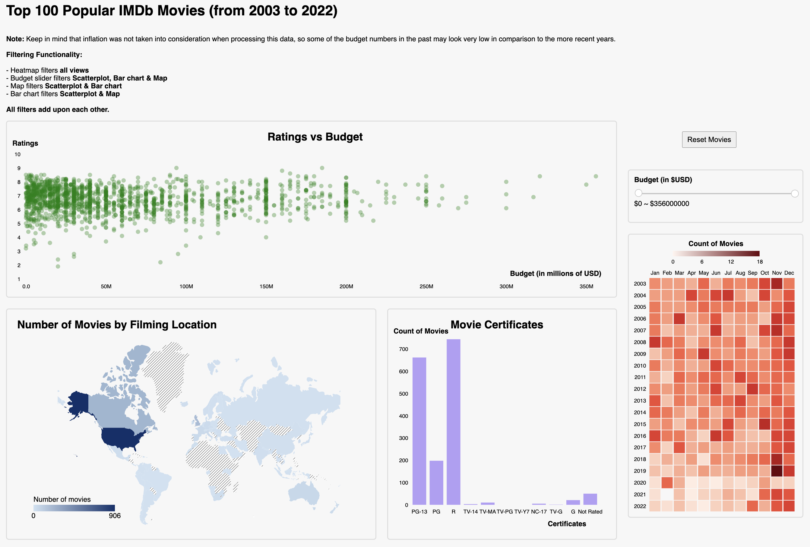

# D3 Project Starter Template

## Overview
The production costs for creating a successful movie can average very high sums in the modern age. Some films can require a budget of up to $350 million to be created. Due to the heavy investment costs required for movie creation, it may be encouraging to be able to ensure that one’s film will be successful both critically and economically before production begins.

Our visualization shows insight into the attributes of top-rated movies that may have contributed to their success.

This interactive visualization will help film producers and directors consider the best environment in which to create their films by comparing various movie budgets, genres, runtime, income, and ratings.

See below a full screen layout of our viz:

## Code References

Budget Slider Code:
https://medium.com/@predragdavidovic10/native-dual-range-slider-html-css-javascript-91e778134816

TopoJSON for World Map (used countries-110m.json):

GitHub: https://github.com/topojson/world-atlas#countries-110m.json  
JSON content: https://cdn.jsdelivr.net/npm/world-atlas@2/countries-110m.json

Case Studies and D3 examples from course code:  

Heatmap template:
https://github.com/UBC-InfoVis/447-materials/tree/23Jan/case-studies/case-study_measles-and-vaccines

Bar Chart:
https://github.com/UBC-InfoVis/447-materials/tree/23Jan/d3-examples/d3-interactive-bar-chart

Scatterplot:
https://github.com/UBC-InfoVis/447-materials/tree/23Jan/d3-examples/d3-interactive-scatter-plot

Geographic (Choropleth) Map:
https://github.com/UBC-InfoVis/447-materials/tree/23Jan/d3-examples/d3-choropleth-map

